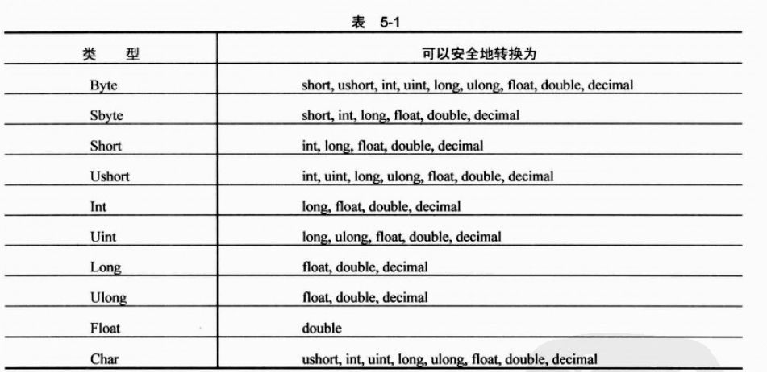
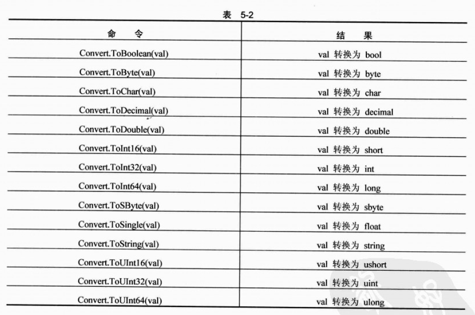

# BeginCSharp-语法

## 注释

和C++一样的注释

    // 注释
    /* 
    ** 注释
    */

和OC的`#pragma mark` 类似的作用

    #region
    
    #endregion
    
## 变量

变量的声明：

    <type> <name>;
    
需要注意的部分，声明不等于定义，这点是和C++不同的地方。定义需要调用

    <type> <name> = new <type>();
    
基础类型除外。基本类型有如下几种：

## 类型转换
可以安全进行的隐式转换

强制类型转换：

    dst = (dst_type) src;
    
这里C#提供了两个能否正常转换或者说是溢出的检查`checked`和`unchecked`：

    dst = checked((dst_type) src);
    
如果发生溢出或者丢失的话，这里会引起程序崩溃。

Convert提供的转换：

这里要区分什么是.net framework的类型，什么是C#的类型（和C/C++基本一致）。    

## 枚举
枚举通过enum来定义，但是一来可以指定类型

    enum orientation : byte 
    {
        north = 1,
        south = 2, 
        east = 3,
        west = 4, 
    }

同时在引用的时候，需要名字，比如 `orientation.north`而不是C++中的"north"

## struct

struct 和C++的类似，但是成员需要用`public`/`private`等来进行修饰

## 数组
C#的数组和C++类似。

来看声明：

    <type>[] <var>
    
    int []intArray; // 声明一个整形数组
    
然后再来定义/初始化

    int []intArray = {1, 2, 3, 4};
    
    或者
    
    int []intArray = new int[4];
    
foreach进行优雅遍历

    foreach ( <type> <var> in <array> ) {
        // use var
    }
    
    foreach ( string name in names) {
        Console.WriteLine(name);
    }

## 字符串

获得字符

1. 通过`ToCharArray()` 来得到一个可以修改的字符数组
2. 遍历得到所有的字符

    foreach (char c in str) {
        // use c 
    }

一些操作

操作|作用
---|---
ToLower()| 转换成小写
Trim()|去头去尾
TrimStart()| 去头
TrimEnd()|去尾
PadLeft(count, char)|左边填充
PadRight(count, char)| 右边填充
...|...

还有n多操作，重点是直接`string`就当做一个对象调用其方法，这个和go/python都是不一样的。

## 运算符

运算符和C++基本一致

## namespace

和C++基本一致，可以嵌套，可以嵌套使用`using namespace;` 并且大量使用`using namespace`，和java的“improt"类似，而和C++中一般不用"using"不同。

## 条件分支

1. 可以通过三元的条件表达式
2. 和C++一样的`if...else.../if...else if...else if...else..`
3. switch语句和C++基本一致，也需要使用break;（和go不一样）。但是和C++不一样的时，他不限于比较整数，任何常量的字面值（数值、字符串）都可以。

## 循环语句
和C++基本一样

1. do ...while 
2. while...
3. for ...
4. 也都有contine/break/goto/return